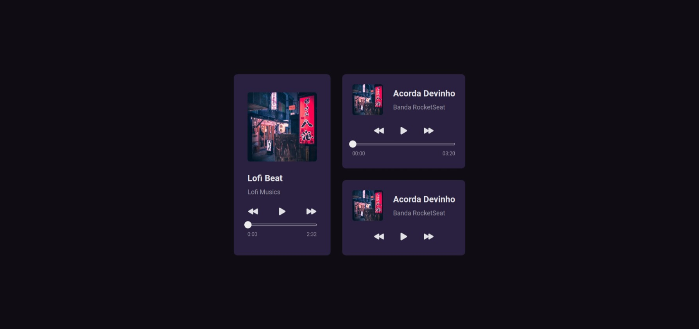

# Desafio Bora Codar - RocketSeat
<a src='https://guilhermehub12.github.io/Music-Player/'>Preview Here</a>
## Player de Música

### Techs Usadas
- HTML
- CSS
- Javascript

### O que aprendi
- Aprendi mais sobre como os estilos do CSS se comportam em formas de caixa, Grid e posições,
- Aprendi a melhor pesquisar sobre o que fazer com javascript,
- A sempre documentar o que fez no projeto;

### New Features
- Adição de músicas
- Adição de novas imagens
- Possibilidade de dar play, pause, voltar e passar música
- Atualização de acordo com o tempo da música será mostrado em número
- Atualização de acordo com o tempo da música será mostrado na barra de progresso